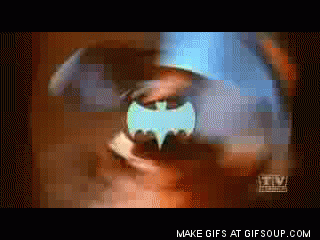

# EcmaScript

<..>

## WAIT

I thought it was called JavaScript...

<..>



<..>

* December 1995, Brendan Eich's "JavaScript" was announced by Sun and Netscape (originally called Mocha)
* March 1996, introduced in Netscape 2.0
* August 1996, JScript introduced in IE 3.0, named this to avoid trademark issues with Netscape
* November 1996, Netscape gave it to Ecma International for standardization (ECMA-262)
* June 1997, first edition of ECMA-262 (aka ECMAScript)

Note:

* See http://en.wikipedia.org/wiki/List_of_Ecma_standards for other ECMA standards, like floppy disk formats, CD-ROM volume and filestructure, C# language specification, JSON, Dart

<..>

## So, what's happened since then?

<..>

* December 1999, regex, string handling improvements, new control statements, try/catch, formatting for numeric outputting, etc.
* ...
* ES4 abandoned
* ...
* \*cough\*
* ...
* December 2009, `'use strict'` added, getters/setters, library support for JSON, etc.
* 2015 (soon), ES6!
* in progress, ES7!!!

Note:

* Lots and lots of politics... read the [Wikipedia post](http://en.wikipedia.org/wiki/ECMAScript) some time
* It's moving again! And fast, too!

<..>

# ES6

<..>

So, what's new?

<..>

* Class support
* `for-of` support
* Arrow functions
* Generators, iterators
* Template functions
* Binary data
* Maps, sets, weak maps
* Proxies
* Destructuring
* And [more](https://github.com/lukehoban/es6features)!

<..>

Let's take a look!

```javascript
class Animal {
  constructor(name, age) {
    this.name = name;
    this.age = age;
  }

  get ageInDogYears() {
    return this.age * 7;
  }

  bark() {
    console.log(`${this.name} barks!`);
  }
}

let x = new Animal("Fido", 3);
x.bark();
console.log(x.age);
console.log(x.ageInDogYears);
```

Note:

* we see classes, getters/setters, string interpolation, `let` keyword
* thoughts? does it look familiar while still adding nice language features?

<..>

Side note... check out [Scratch JS](https://chrome.google.com/webstore/detail/scratch-js/alploljligeomonipppgaahpkenfnfkn)

<..>

```javascript
function* generator() {
  let count = 0;
  const max = 10;
  while (true) {
    yield count;
    count++;
    if (count >= max) {
      break;
    }
  }
}

for (let x of generator()) {
  console.log(x);
}
```

Note:

* generators! (same idea as `yield` in ruby)
  * note the `*` - it is required to indicate that a function yields
* constants
* `let` and `for-of` over iterables

<..>

```javascript
[1, 2, 3, 4, 5, 6, 7, 8, 9, 10].map(x => {
  if (x % 2 === 0) {
    console.log(x);
  }
});
```

Note:

* arrow functions! yay!!! (this retains outer scope here, too)
* `===` still exists...

<..>

Other nice things... module support (`import`/`export`), Symbols, native Promise support, and more

<..>

### Good resources

* [http://es6-features.org/](http://es6-features.org/)
