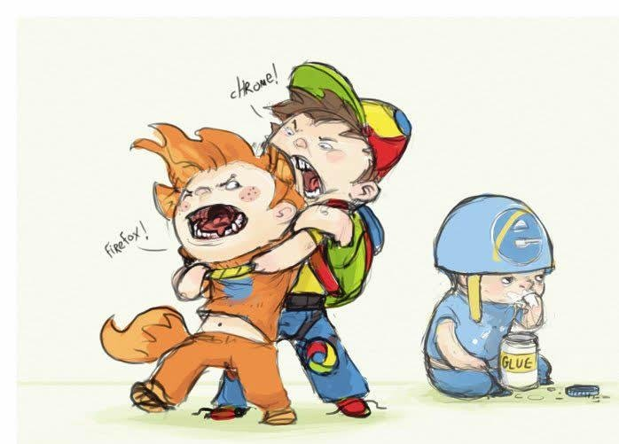

# ES6 and Ruby

<..>

> "Well cool, I'm all excited about it. How do I go about using it?"

<..>

## You could just wing it and hope the browser supports it...



Note:

* ES6 works in Firefox after all.
* See [ES6 compat table](http://kangax.github.io/compat-table/es6/)
* Depending on the browser, you might get decently far actually

<..>

> "Wait... come on. Won't it take _ages_ for the browsers to get up to date with ES6? Even with evergreen browsers, that's still not great."

<..>

## You could use transpilers!

> A source-to-source compiler, transcompiler, or transpiler is a type of compiler that takes the source code of a programming language as its input and outputs the source code into another programming language.

See [BabelJS](https://babeljs.io)

<..>

If this sounds familiar, that's because it is.

CoffeeScript, TypeScript, Dart, ClojureScript...

They all compile to JavaScript

(watch ["The Birth and Death of JavaScript"](https://www.destroyallsoftware.com/talks/the-birth-and-death-of-javascript))

Note:

* per @jashkenas, ["this was always part of the plan"](https://news.ycombinator.com/item?id=8972404) re: CoffeeScript. CS (and other transpiled languages) moved the language forward to help prepare for ES6
* remember those 10 years of _nothing_?

<..>

## You could do it the easy way

```ruby
gem 'sprockets-es6'
```

(assuming you're using Sprockets...)

Note:

* ES6 support is coming with [Sprockets 4.0](https://github.com/sstephenson/sprockets/pull/682)
* In the meantime, if you're on Sprockets 3.0, you can use the `sprockets-es6` [gem](https://github.com/TannerRogalsky/sprockets-es6).
