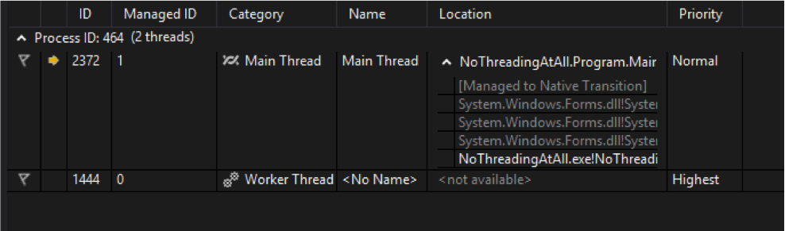
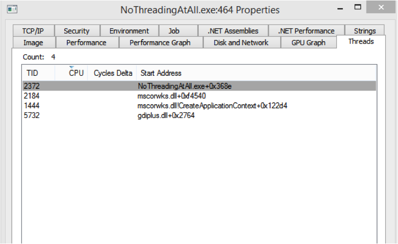

# Threading Basics

<..>

## Example 01: No (Additional) Threading

   <ul>
      <li>Do you find it surprising that there are still 4 threads?</li>
      <li>What are they?</li>
   </ul>

Note:

* The starting addresses give us a few hints
  * For example, gdiplus.dll is related to GDI+ (graphics)
  * mscorwks.dll is one of the core CLR assemblies
  * And of course there is our assembly
* But... VS2012 has some really nice threading tools

<..>

## Visual Studio 2012 Threads

Note:

* Interesting that VS only shows two threads compared to the four in procexp
  * It doesn't show the gdiplus one or the mscorwks one (without the "CreateApplicationContext" call)
* The gdiplus one is just for GDI (unmanaged graphics library)
* The CreateApplicationContext one is in all managed applications
  * In .NET 2.0-3.5, it looks like this
  * In .NET 4.0-4.5, it instead comes from clr.dll
  * Sort of like .NET's "void main"
* The other thread that actually is showing up? The one that is running at highest priority?
  * That's the GC thread
* You'll get more detail if you have symbols set up

<..>

## The Actual Run

* Observations
  * Was it responsive?
  * Was it fast?

Note:

* Responsive? Nope, not at all
* Fast? Not bad... 3 seconds total to count to 100,000

<..>

## Example 02: Single Thread (The Wrong Way)

      var thread = new System.Threading.Thread(DoWork);
      thread.Start();

* All we did was new up a `System.Threading.Thread` instance and pointed it to our work method
* Disclaimer - this code breaks some rules... in fact, it breaks _the golden rule of threading_
  * Never update anything on the UI thread if you're not on the UI thread
* Observations
  * Is it responsive?
  * Is it fast?

Note:

* Responsive? Sure!
* Fast? Nope!
  * Why?
  * Because you're basically updating the UI thread and your work thread can't spend its time actually counting

<..>

## Example 02: Fix the GUI Thread

      BeginInvoke(new Action<object>(x => {
         txtCount.Text = x.ToString();
      }), i);

* In WinForms, you use `Control.Invoke` or `Control.BeginInvoke`
  * `Invoke` executes on the UI thread, but waits for completion before continuing (can prevent shared state issues)
  * `BeginInvoke` executes on the UI thread, but doesn't wait for completion before continuing (fire and forget... sort of)
* In WPF, you use `Dispatcher.Invoke` or `Dispatcher.BeginInvoke`
  * Same semantics as above

<..>

## Example 02: BeginInvoke versus Invoke

* Which one performs well?
* Which one is responsive?
* What's the problem?

Note:

* Invoke
  * Still responsive, but performs poorly
  * Basically the same as before – we're having to wait on the UI thread
* BeginInvoke
  * No longer responsive, but performs well
  * Why?
  * The UI thread is getting HAMMERED with changes... Given its load, it can't respond to input also
* The solution is to not update the thread every time
  * The user does not need to know about every single change... the user couldn't even see every number if they tried.
* Let's try batching our UI updates every 500 times
  * WOW... we went from at best 2-3 seconds. Now we're looking at only 10 milliseconds.
  * Your computer is really good at computational things, but shared state is tricky

<..>

## Example 03: BackgroundWorker

      using (var worker = new System.ComponentModel.BackgroundWorker()) {
         worker.WorkerReportsProgress = true;

         worker.DoWork += DoWork;
         worker.ProgressChanged += (o, args) => {
            txtCount.Text = args.UserState.ToString();
         };
         worker.RunWorkerCompleted += (o, args) => {
            txtTotalTime.Text = args.Result.ToString();
         };

         worker.RunWorkerAsync();
      }

<..>

## Example 03: BackgroundWorker

* Introduced in .NET 2.0 because threading is hard
  * And because everyone was updating the UI thread from the background thread
* It falls in the easy category because...
  * It wasn't written by the threading team, but instead by the WinForms team (even lives under the `System.ComponentModel` namespace)
  * It can be dropped on your design surface
  * It automatically marshals calls back to the UI thread for you (via its events)

<..>

## Example 04: ThreadPool Threads

      ThreadPool.QueueUserWorkItem(DoWork);

* Thread construction is expensive
  * They're good for long running background tasks, but if you're doing lots of small tasks, use a `ThreadPool` thread instead
* The CLR provides a "pool of threads" for you that are all ready to go
  * ASP.NET uses the ThreadPool for all of its requests
  * WCF uses the ThreadPool
  * And so on

<..>

## Quick aside... when should I use which?

* `BackgroundWorker`
  * Only use this if you're in WinForms or WPF or another GUI technology
* `ThreadPool`
  * Efficiency
  * Default to using this
  * Tasks (we're not there yet) are ThreadPool threads…
* `Thread`
  * Long running request
  * You need more control over thread details (i.e. priority, identity, etc.)

Note:

* Not even taking into account Tasks and the TPL right now… but those are ThreadPool threads

<..>

## How Do We Deal With Shared State?

* Try to avoid it
* But you know you can't always avoid it
* `lock` (or `SyncLock` for your crazy VB guys/gals)
  * Same as `Monitor.Enter` / `Monitor.Exit`
  * Could use `Interlocked.Increment` / `Interlocked.Decrement` (atomic operations)
* `ReaderWriterLockSlim`
  * There is a long story about the name
* `Mutex`
  * "MUTually EXclusive"
  * For cross process shared state (or inter-process communication)
* And more...

Note:

* `ReaderWriterLockSlim` – introduced because the original ReaderWriterLock performance was horrible... and Microsoft didn’t want to break backwards compatibility
  * Weird, I know
* Mutexes – common uses that you see all the time are when apps keep only a single instance alive
* Most of the time, you can just use a "lock" statement

<..>

## Example 05: IAsyncResult

      var iar = dlg.BeginInvoke(
         arg,
         Callback,
         new Tuple<Func<int, int>, int>(dlg, arg));

* Sometimes called the [Asynchronous Programming Model \(APM\)](http://msdn.microsoft.com/en-us/library/ms228963.aspx)
* 80+% of the time you consume APM instead of writing it yourself
* Usually only have to implement it when you're writing your own libraries

<..>

## Example 06: Why IAsyncResult versus...?

* So... why would I go through all of that complexity as compared to just using a ThreadPool thread on my own?
  * It has _everything_ to do with having a blocking thread or not

Note:

* ResourceDownloader / GetResource.ashx is used basically to proxy images on templates through our site so that all resources are served over HTTPS
  * See GetResource.ashx.cs (can't share unfortunately)
* Why did it need to be threaded in the first place?
  * Remember that ticketing bug with the Singing Christmas Tree and the Bellevue website from last year?
  * They were using an old template that referenced an image on the Bellevue website instead of our website
  * Their site couldn't handle the load (or had a bug or something)
  * Our site could handle it fine... except that we were waiting on their site to serve the image
  * And thus, our site was now having issues
  * Note that this isn't the kind of problem that can be solved by adding hardware either
    * We were running at very low CPU because we weren't doing ANYTING
    * IIS was still serving requests, but remember the scheduling discussion from last time? The CPU has to give all of the threads a chance to work... it doesn't know if one is blocking or not.
* Initial version doesn't even pretend to use threading
* Threaded version uses a thread... but still waits for the results
  In fact, with that version, we've got TWO blocking threads now instead of just one – it got WORSE
* Final version is more complex, but the .NET Framework is trying to guide you down the right path
  * Look at IAsyncHttpHandler versus the IHttpHandler
  * See http://msdn.microsoft.com/en-us/library/system.web.ihttphandler(v=vs.110).aspx
  * ResourceDownloader is actually used by GetResource.ashx.cs
  * Note that the real version actually uses a custom AsyncData object instead of an object array
